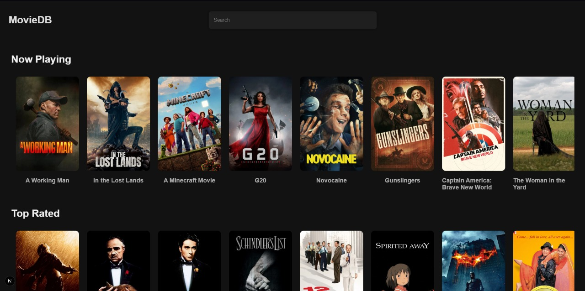
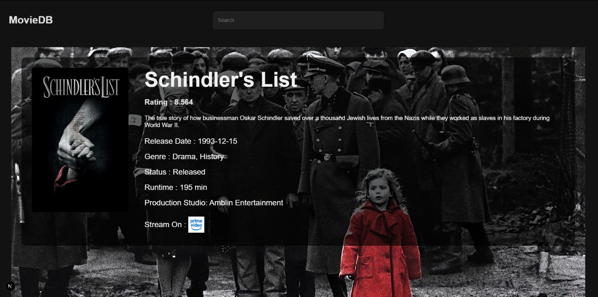
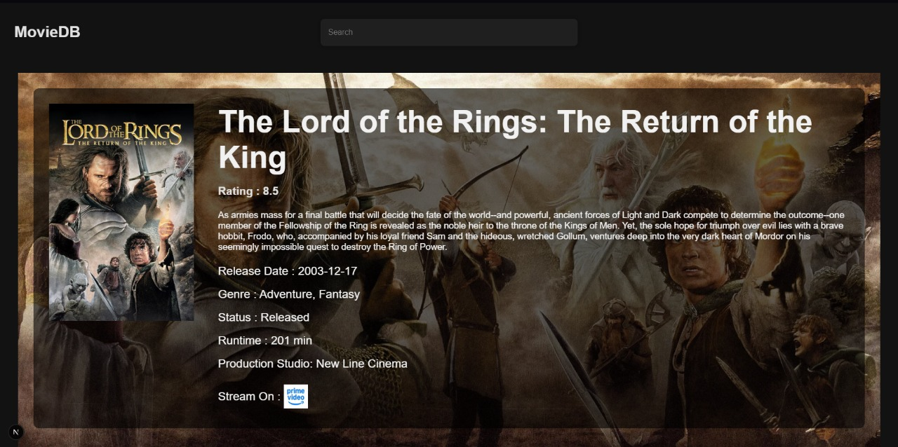

# Movie Database (Repo Sprint Starter)

This is a lightweight Next.js starter for the Repo Sprint event.

Notes for participants:
- The UI renders placeholder cards on the home page to help you focus on layout first.
- API calls have been intentionally removed from the grid/cards. See TODO comments in files for integration spots.
- Check `CONTRIBUTING.md` for how to participate and submit your work.

Happy hacking! 🚀
# 🎬 Movie DB App

A sleek and responsive movie database web app built using **Next.js**, allowing users to search, explore, and view detailed info about movies and TV shows using the [TMDB API](https://www.themoviedb.org/documentation/api).


## 🚀 Features

- 🔍 Search movies and TV shows by title
- 🖼️ Browse popular and trending content
- 📄 View detailed info like synopsis, rating, release date, and more

## 🛠️ Tech Stack

- **Frontend:** Next.js, React
- **API:** TMDB API, JustWatch
- **Styling:** CSS

## 📦Installation

Use the package manager [pip](https://pip.pypa.io/en/stable/) to install foobar.

```bash
git clone https://github.com/your-username/movie-db-app.git
cd movie-db-app
npm install
npm run dev
```
App runs on ``http://localhost:3000``

### 🔑API Key Setup
1) Create a free account on [TMDB](https://www.themoviedb.org/)

2) Get your API key from TMDB API settings

3) Create a .env.local file in your project root:
```bash
NEXT_PUBLIC_TMDB_API_KEY=your_tmdb_api_key_here
```

## 📄License
This is a personal project that i made to better my skills in web development
## 📸 Screenshots

### 🔹 Home Page


### 🔹 Movie Details Page



## 📤 Deployment
Deployed on : [Movie DB App](https://movie-db-project-ca3r.vercel.app/)

## 🙌 Acknowledgements
- [TMDB API](https://www.themoviedb.org/)
- [Next.js](https://nextjs.org/)
- [JustWatch](https://www.justwatch.com/) (For provider info)